# PBRoller
Tired of manually mixing your natural peanut butter? Tired of getting oil everywhere and making a mess? Look no further! Simply place your peanut butter jar on the PBRoller, leave it for a few hours, and come back to perfectly mixed peanut butter!

## Build Instructions
### Parts List
Before you get started, here are all the things you'll need to buy to build your very own PBRoller. For reference I've included links to the products I purchased:
1. Raspberry Pi Pico
    - Source from your local [Raspberry Pi authorized reseller](https://www.raspberrypi.com/resellers/)
1. [Easy Driver Stepper Motor Controller](https://ca.robotshop.com/products/easydriver-stepper-motor-controller-a3967)
1. [NEMA 17 Stepper Motor (12V and 350mA)](https://www.pishop.ca/product/stepper-motor-nema-17-size-200-stepsrev-12v-350ma/)
1. [NEMA 17 Stepper Motor Mount](https://a.co/d/4L3NoFJ)
1. 12V Power Supply (I use one I had laying around)
1. [M2x4mm Screws](https://www.amazon.ca/dp/B0C38YFL3D)
1. [M2x6mm Screws](https://www.amazon.ca/dp/B0C38YFL3D)
1. [M4x8mm Screws](https://www.amazon.ca/dp/B0C38YFL3D)
1. [M2x4mm Heat Set Nuts (3.2mm outer diameter)](https://www.amazon.ca/dp/B0CNRSJ1B2)
1. [M4x4mm Heat Set Nuts (5.2mm outer diameter)](https://www.amazon.ca/dp/B0CNRSJ1B2)
1. [Rocker Switch](https://abra-electronics.com/electromechanical/switches/rocker-switches/com-08837-rocker-switch-spst-right-angle-com-08837.html)
1. [12V DC Barrel Connector (11mm outer diameter)](https://www.amazon.ca/dp/B08SJM2G52)
1. [Heat sinks](https://www.amazon.ca/dp/B0814V66JV) (optional, but the Easy Driver can get pretty hot)
1. [Skateboard Bearings](https://a.co/d/eMN2Fxm)
1. [8mm metal rod](https://a.co/d/23PNJWb)
1. Solder and wire
1. Heat shrink tube

### 3D Printed Parts
Print all parts with 0.2mm layer height and 15% infill. I recommend printing the gears with 4 wall loops for some added strength.

I've included [Bambu Studio Project file](docs/models/pbroller.3mf) with all parts laid out on two build plates and configured.

|Model|Image|Details|
|-----|-----|-----------|
|[Base Part 1](docs/models/base_part_1.stl)|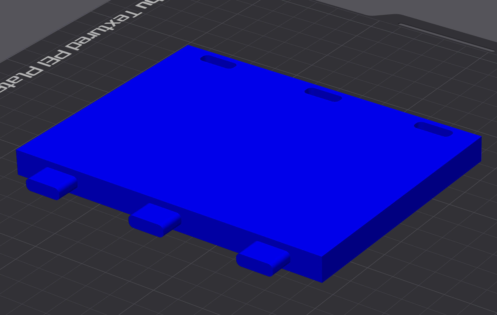|Base of the PBRoller. Connects to the second part of the base using some pegs. The left side slots into the holes.  **Print Orientation**: Right side up **Quantity**: 1 **Supports**: Yes|
|[Base Part 2](docs/models/base_part_2.stl)|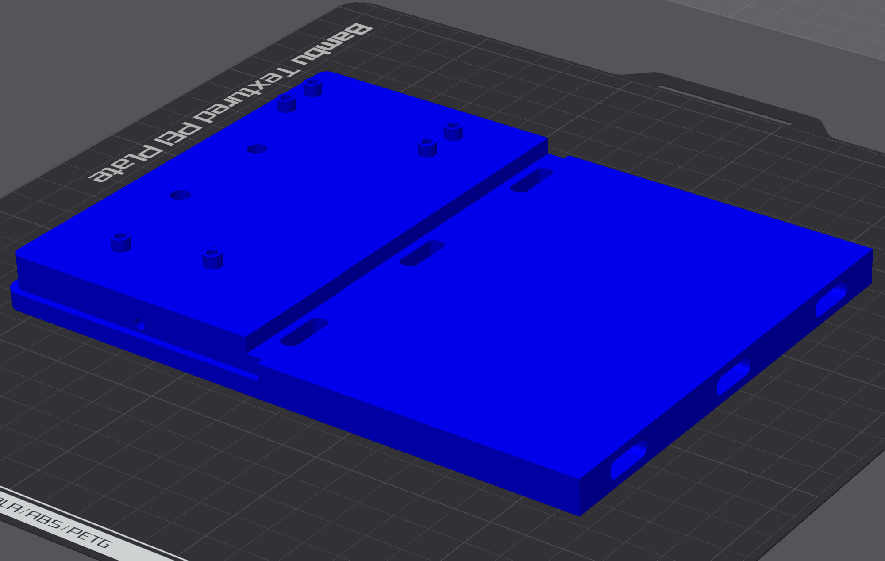|Second half of the PBRoller base. Contains holes for heat set nuts for mounting the stepper motor, Pi Pico, Easy Driver, and for attaching the cover. The right side slots into the holes.  **Print Orientation**: Right side up **Quantity**: 1 **Supports**: No|
|[Left Side](docs/models/left_side.stl)|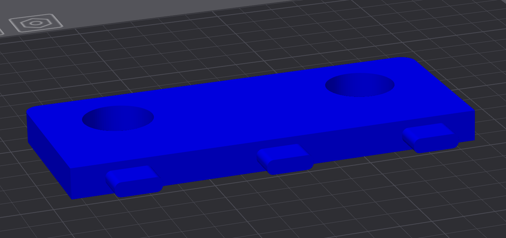|The left bracket of the PBRoller, which slots into the first base part using the pegs. Skateboard bearings are pressed into the two large openings to hold the rollers.  **Print Orientation**: Right side up **Quantity**: 1 **Supports**: Yes|
|[Right Side](docs/models/right_side.stl)|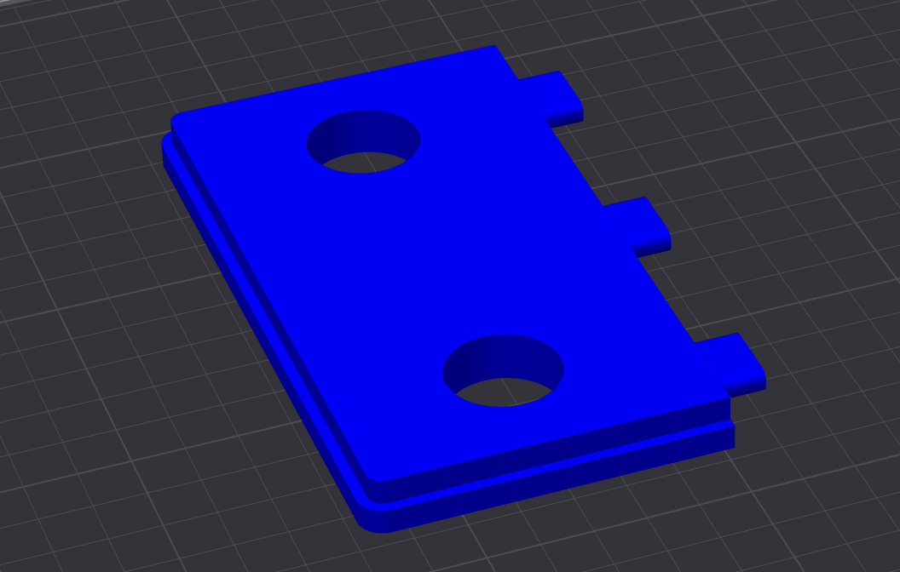|Right bracket of the PBRoller, which slots into the second base part using the pegs. Skateboard bearings are pressed into the two large openings to hold the rollers.  **Print Orientation**: Right side up **Quantity**: 1 **Supports**: Yes|
|[Large Gear](docs/models/large_gear.stl)|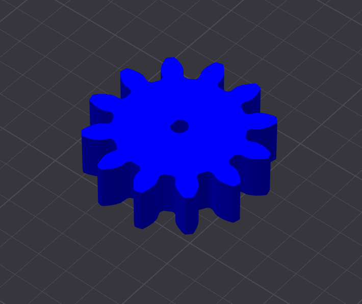|Press fits to the stepper motor and drives the two smaller gears which drive the rollers  **Print Orientation**: Right side up **Quantity**: 1 **Supports**: No|
|[Small Gear](docs/models/small_gear.stl)|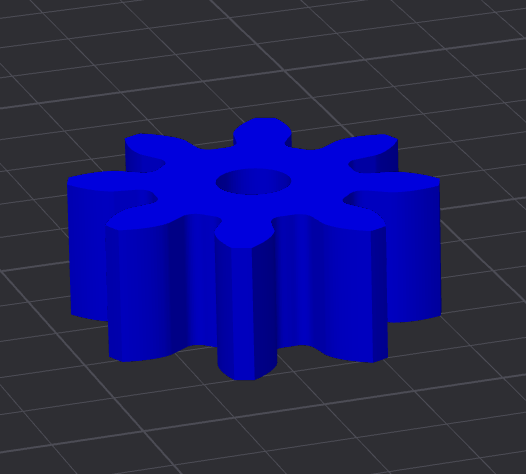|The two small gears are press fit onto the 8mm rod and drive the rollers.  **Print Orientation**: Right side up **Quantity**: 2 **Supports**: No|
|[Cover](docs/models/cover.stl)|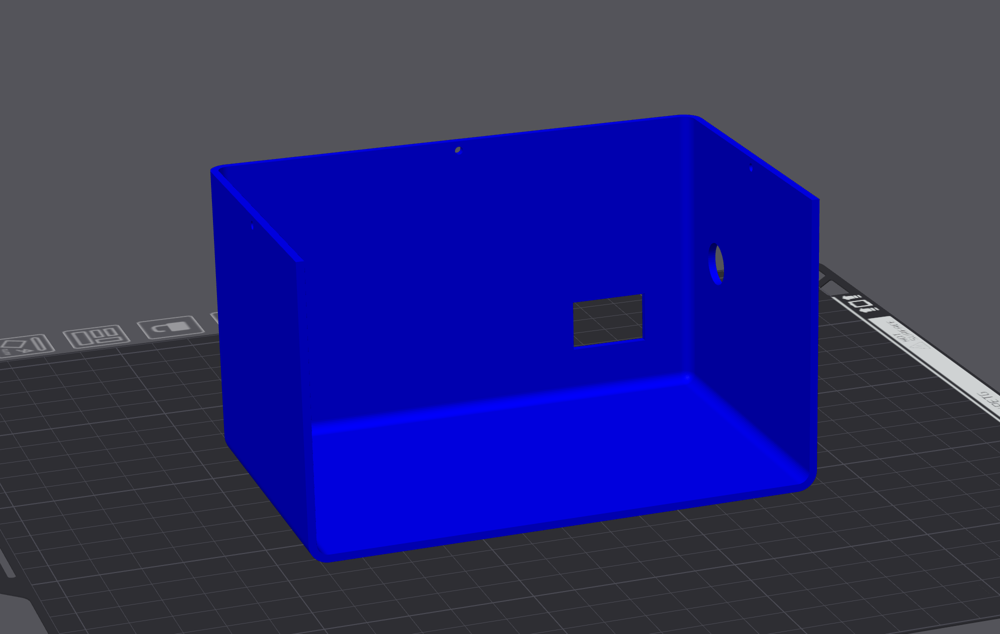|Covers the electronics and stepper motor. Attaches to the base using 3 M2 screws. Has holes for the rocker switch and barrel connector.  **Print Orientation**: Up side down **Quantity**: 1 **Supports**: No|

### Assembly
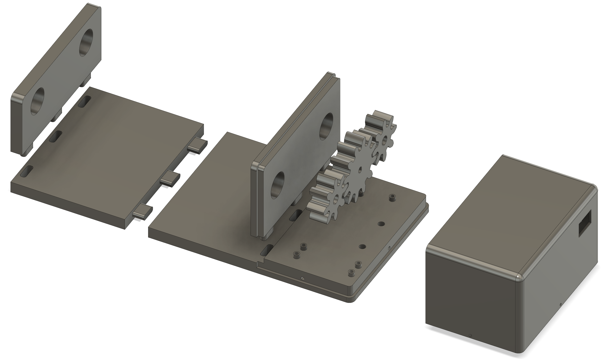

Begin by setting the M2 heat set nuts into the three holes in the sides and back of Base Part 2 where the Cover attaches. Continue by setting the other M2 heat set nuts which hold the electronics, and the two M4 heat set nuts which the stepper motor mount attaches to.

Connect the two halves of the base together. You may have to clean up/file the pegs a little to get a good fit. Press the skateboard bearings into the Left Side and Right Side before attaching them to the base by by pressing them into their respective slots (again, you may need to clean up the pegs to get a good fit).

Cut the 8mm rod into two lengths of 21cm. Press a small gear onto the end of each (they're a tight fit - you may need to ream the gears out a little with a drill bit or a file). Slide the rods through the bearings and into place. Make sure there's sufficient clearance between the gear and the side so that nothing is rubbing and the rollers are spinning freely. Apply a small dab of super glue to attach the metal rod to each bearing.

Press the large gear onto the end of the stepper motor. Attach the stepper motor to the mount and attach the mount to the base using the M4 screws. Now it's time to wire everything up!

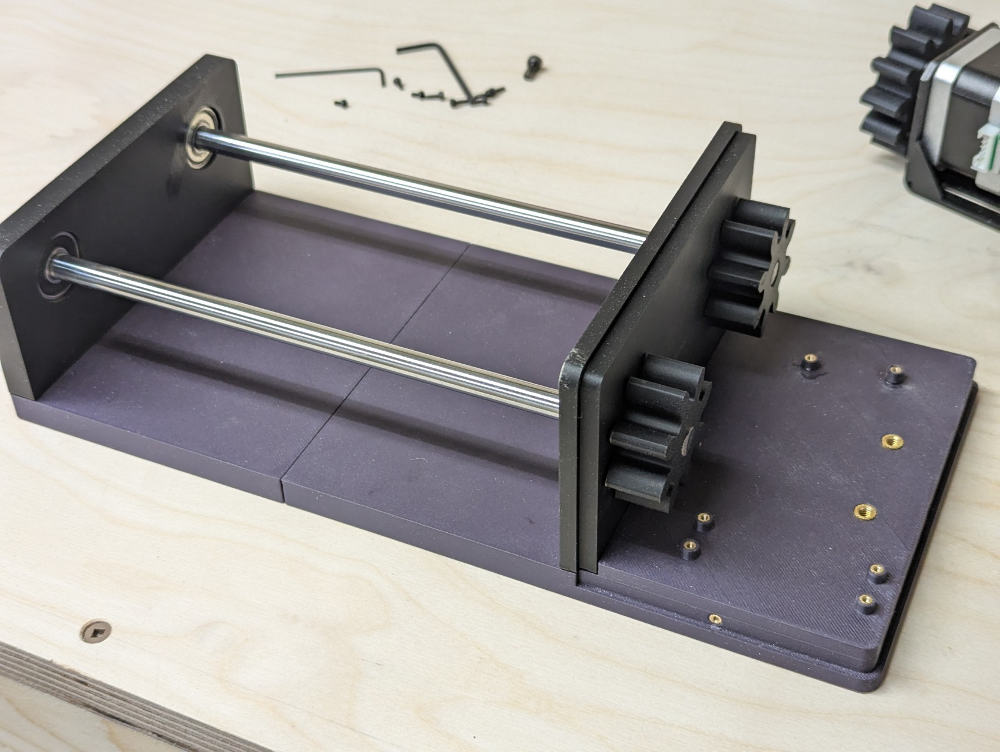

### Electronics
Since the Pico uses 3.3V logic, the first thing you should do is switch the Easy Driver to use 3.3V logic as well by soldering SJ2 closed (placing a small glob of solder on the two pads on the bottom left hand corner of the board where it's written "5V/3V"). You can confirm you've done this correctly by measuring the voltage across the +5V Output and GND, which should now be 3.3V.

Next, wire the Easy Driver to the Pico as follows:
1. DIR -> GP15
1. STEP -> GP14
1. GND -> GND (Pin 18)
1. SLP -> GP13 

The Easy Driver has a 5V (3.3V) output which I'm taking advantage of to power the Pico. Wire the 5V (now 3.3V) output on the Easy Driver to VSYS on the Pico, and GND to GND.

Mount the barrel connector to the cover using the nut it comes with. Wire the switch in series on the positive side of the power leads coming off the barrel connector, and snap the switch into the cover. Then, solder the positive and negative leads to PWR IN and GND on the Easy Driver. 

**Note:** I've opted to solder headers to each board and make the connections using jumper wires. That being said, it's important to make sure the PWR IN and stepper motor connections are solid or you risk blowing up the Easy Driver. Always power off the Easy Driver before plugging/unplugging the stepper motor!

Mount the Pico and Easy Driver to the base using M2 screws. Plug in the stepper motor to the Easy Driver. Now it's time to program the Pico!

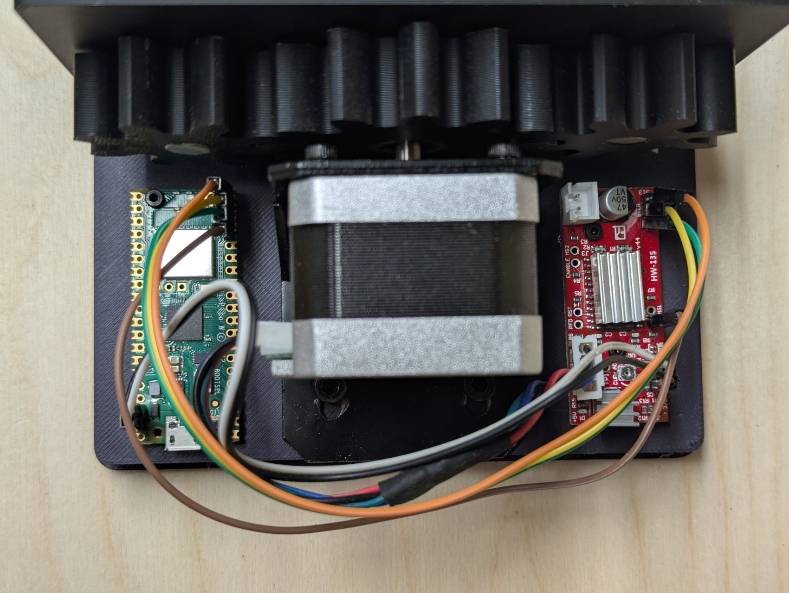
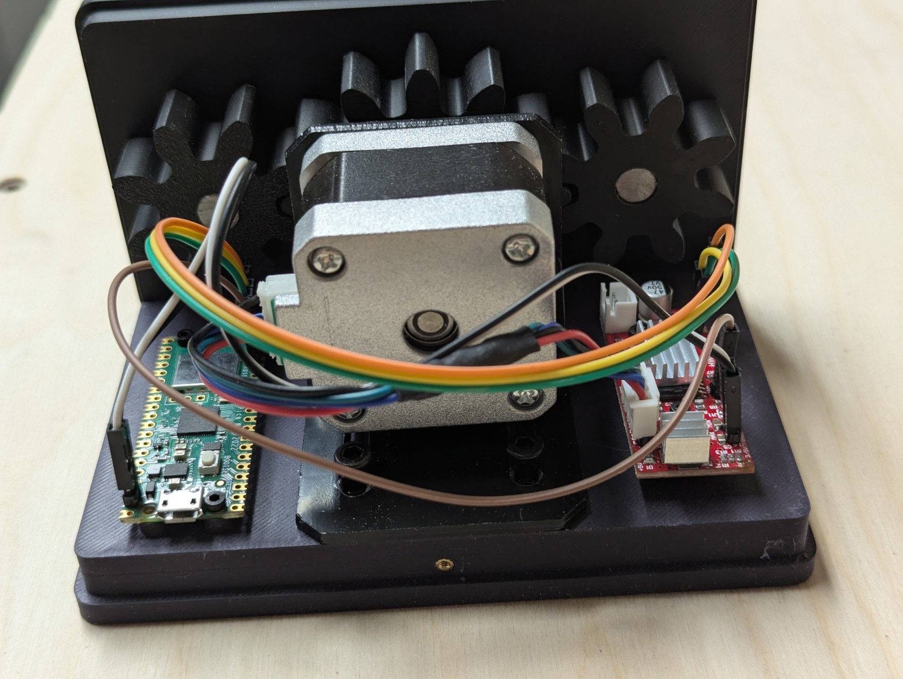

### Code

The PBRoller software for the Pico is written in Micropython. Follow the [instructions here](https://www.raspberrypi.com/documentation/microcontrollers/micropython.html) to flash Micropython onto your board.

I also recommend setting up a Visual Studio project and installing the [MicroPico extension](https://github.com/paulober/MicroPico) to copy the code to the board.

#### main.py

This is the Micropython code which runs on the Pico and interfaces with the Easy Driver to turn the stepper motor and roll the peanut butter jar. It's only a couple of lines of code and simply spins the jar 180 degrees, sleeps for 30 seconds, then repeats. In my testing I found this method of pausing and spinning to give the best mix.

To run the code on your Pico, connect your Pico to your computer, and wait for VSCode to show "Pico Connected" in the bottom toolbar. Then right click on `main.py` and click "Upload current file to Pico".

You should now be all set! Power everything up and let the good times roll.